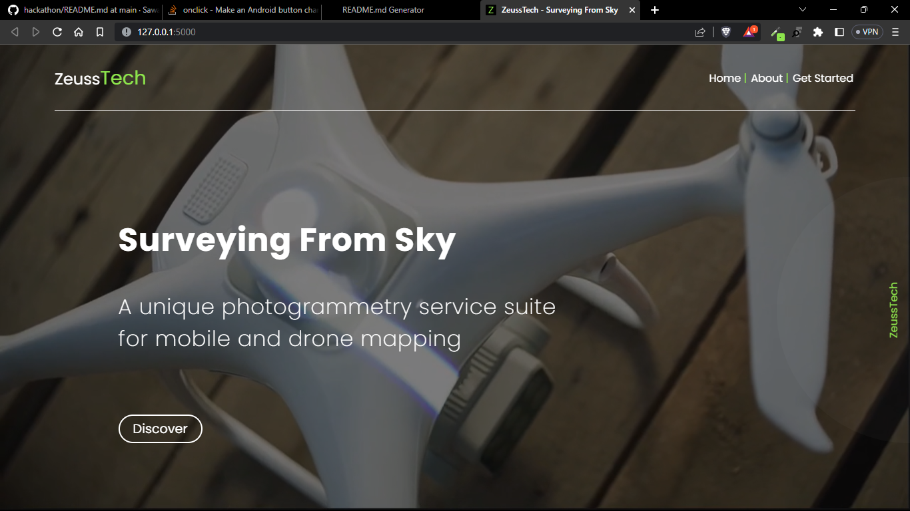
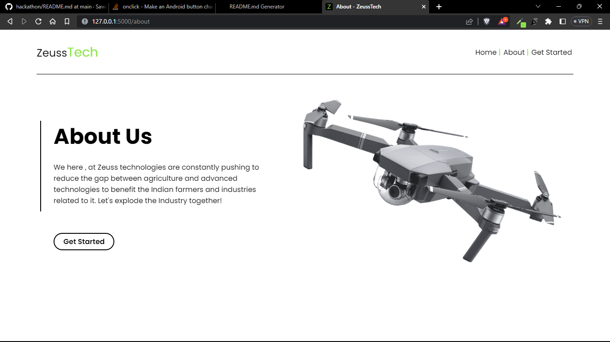
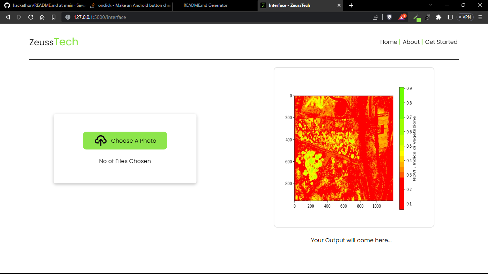

<h1>Zeuss</h1>

End to end service for farmers to get their crop's analysed for diseases, soil and plant nutrients,water content, etc by using multispectral drone imaging technology.
<h2>General Information</h2>

<ul>
<li>We started with developing a drone to collect the multispectral images of farms. The drone is fully autonomous , it flies to the desired field , map the area and bring the data along with it.
The data then gets uploaded to our developed web app (Zeuss tech) to calculate the NDVI(normalized difference vegetation index) and overall crop health.</li>
</ul><ul>
<li>Identification of crop diseases in early stages to prevent the further spread of the disease , calculating the nutrients defeciency in soil and plant , (extra usecases of drone are - Identifying humans during a disaster like earthquakes, floods, etc by using thermal camera, pollution monitoring in urban environmment identifying the source of emission).</li>
</ul><ul>
<li>Identification of crop diseases in early stages to prevent the further spread of the disease , calculating the nutrients defeciency in soil and plant to help farmers in using advanced mapping technologies in farming for optimal production.</li>
</ul><h2>Technologies Used</h2>

<ul>
<li>HTML</li>
</ul><ul>
<li>CSS</li>
</ul><ul>
<li>JavaScript</li>
</ul><ul>
<li>Flask</li>
</ul><ul>
<li>python</li>
</ul><h2>Features</h2>

<ul>
<li>use of drone</li>
</ul><ul>
<li>clean and minimalist ui</li>
</ul><ul>
<li>use tif files to generate NDVI image from the /static/images directory</li>
</ul><ul>
<li>identify are that area problematic in crop</li>
</ul><ul>
<li>used flask</li>
</ul><ul>
<li>identify water and nutrient deficiencies</li>
</ul><h2>Setup</h2>

all the project dependencies are put together into \requierments.txt
<h5>Steps</h5><ul>
<li>install all the dependencies in \requirements.txt with the help of the terminal command pip install requirements.txt</li>
</ul><ul>
<li>install extension: live server, coderunner</li>
</ul><ul>
<li>open the python file and run the coderunner extension (must have python installed)</li>
</ul><ul>
<li>after running the python file go into the terminal and ctrl + click on the port number in the command terminal</li>
</ul><ul>
<li>you are good to go to watch out whole site!!</li>
</ul><h2>Usage</h2>

Identification of crop diseases in early stages to prevent the further spread of the disease , calculating the nutrients defeciency in soil and plant , (extra usecases of drone are - Identifying humans during a disaster like earthquakes, floods, etc by using thermal camera, pollution monitoring in urban environmment identifying the source of emission).
<h2>Project Status</h2>

prototype stage
<h2>Features that can be added</h2>

<ul>
<li>interactive results like google maps</li>
</ul><ul>
<li>more matrices and better dataset</li>
</ul><ul>
<li>alive and automated detection of affected areas</li>
</ul>

